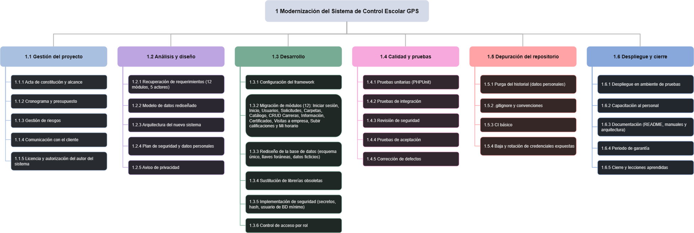

# Alcance del Proyecto de Reingeniería
## Sistema de Control Escolar de Servicio Social y Residencia Profesional

| Dato | Descripción |
|---|---|
| Proyecto | Modernización del Sistema de Control Escolar GPS |
| Consultora | Consultora TecNM Solutions |
| Director | Myrka Salazar |
| Cliente | Instituto Tecnológico de Matehuala |
| Versión | 1.0 |
| Fecha | Septiembre 30, 2026 |

---

## 1. Objetivo del Alcance

Definir con precisión qué trabajo incluye y qué trabajo **no** incluye el proyecto de reingeniería, para evitar malentendidos con el cliente y controlar la desviación del proyecto (*scope creep*).

El sistema actual es una aplicación web en PHP 7.2.34 y MariaDB 10.4.14, con 11,039 líneas de código propio, 49 vistas y 12 módulos, construida con el patrón MVC de forma manual y sin framework (`index.php` carga todos los controladores y modelos en cada petición). El proyecto conserva sus funciones y corrige la plataforma, la seguridad, la base de datos y el cumplimiento legal.

---

## 2. Alcance incluido (In-Scope)

### 2.1 Migración tecnológica

- Migrar la aplicación de **PHP 7.2.34** (sin soporte desde nov. 2020) a **PHP 8.2 o superior**.
- Adoptar un framework PHP vigente (Laravel o Symfony, a decidir en el paquete 1.2.3) con arquitectura MVC ordenada, que sustituya el `index.php` que carga todo de golpe por un enrutamiento con carga bajo demanda.
- Migrar los **12 módulos**: Iniciar sesión, Inicio, Usuarios, Solicitudes, Carpetas, Catálogo, CRUD Carreras, Información, Certificados, Visitas a empresa, Subir calificaciones y Mi horario.
- Sustituir dependencias obsoletas:
  - `PHPExcel 1.8.0` → **PhpSpreadsheet**
  - `jQuery 1.9.1` → jQuery 3.x
  - `Bootstrap 3.3.7` → Bootstrap 5.x
  - `AdminLTE 2.4.0` → AdminLTE 4.x (la versión 3.x usa Bootstrap 4; para Bootstrap 5 corresponde la 4.x)
  - Actualizar `TCPDF` y `PHPMailer` a versiones con soporte.
- Administrar dependencias con **Composer** y retirar `bower_components` (~6,800 archivos) del repositorio.

### 2.2 Rediseño de base de datos

- Unificar los **3 respaldos `.sql`** de la raíz en un **esquema único versionado**, con scripts de migración.
- Declarar todas las **llaves foráneas** (hoy hay 0 cláusulas `REFERENCES`).
- Elaborar **diccionario de datos** identificando datos personales.
- Normalizar el esquema para eliminar redundancias.
- Validar el modelo contra el sistema real: el modelo entidad-relación de la Práctica 4 muestra 11 entidades, pero la estimación de la Práctica 5 contó 17 archivos lógicos internos y no incluye entidades de empresa o visita, que usan los módulos Catálogo y Visitas a empresa.

### 2.3 Seguridad

- Eliminar el **100 % de credenciales y secretos** incrustados en el código (R01, R03, R04, R05).
- Rotar o dar de baja todas las credenciales expuestas (base de datos, correo y claves de cifrado).
- Sustituir contraseñas en texto plano por `password_hash()` (R02) y dejar de guardar la clave en `$_SESSION`.
- Usar un único usuario de base de datos con **privilegios mínimos** (eliminar `root` sin contraseña) y una sola clase de conexión en lugar de 4 archivos.
- Implementar **control de acceso por rol** para los 5 perfiles identificados:

| Perfil (rol en BD) | Acceso principal |
|---|---|
| Administrador (`Admin`) | Acceso completo; único con Solicitudes, CRUD Carreras e Información; único que crea usuarios Admin o Jefe |
| Alumno (`Alumno`) | Autoservicio: catálogo, Mi horario, sus carpetas, su constancia y sus visitas |
| Asesor Académico (`a_Academico`) | Usuarios, catálogo, carpetas de sus alumnos, calificaciones, certificados y visitas |
| Asesor Industrial (`a_Industrial`) | Carpetas, certificados y visitas a empresa |
| Jefe (`Jefe`) | Usuarios, catálogo, carpetas, calificaciones y certificados |

- Aplicar el **principio de mínimo privilegio** en la gestión de usuarios. En el sistema actual, el Asesor Académico y el Jefe pueden editar y eliminar a *cualquier* usuario, incluidos los Admin (según `actores.md`). Se restringe para que solo gestionen usuarios dentro de su ámbito.

### 2.4 Cumplimiento legal y datos personales

- Retirar del repositorio y de su historial los documentos con datos personales (carpetas `Kardex/`, `IMSS/`, `Servicio/`, `Documentos/` y los `.sql`).
- Publicar **aviso de privacidad** conforme a la normativa de protección de datos personales aplicable al Instituto, cuya redacción se valida con su área jurídica. Al ser una institución pública, conviene confirmar si le corresponde la ley para particulares o la de sujetos obligados.
- Minimizar los datos recabados (`numIMSS`, `fechanac`, `direccion`, `telefono`, `correo`), cifrar los sensibles y registrar los accesos.
- Trabajar únicamente con **datos ficticios** durante el desarrollo y las pruebas.
- Gestionar por escrito la **autorización o licencia** del autor del sistema (R08).

### 2.5 Depuración del repositorio

- Purgar el historial con `git filter-repo` para eliminar archivos con datos personales.
- Agregar `.gitignore` adecuado.
- Definir convención de commits.
- Configurar integración continua básica (CI).

### 2.6 Calidad y documentación

- Crear pruebas automatizadas con **PHPUnit**, cobertura mínima **60 %** en flujos críticos (login, alta de solicitud, generación de documentos e importación de Excel).
- Realizar pruebas de integración, revisión de seguridad y pruebas de aceptación con el Instituto.
- Entregar **README técnico**, **manual de instalación**, **manual de usuario** y documentación de arquitectura.

### 2.7 Despliegue y capacitación

- Desplegar en ambiente de pruebas del Instituto.
- Capacitación básica al personal usuario.
- Periodo de garantía para corrección de defectos.

---

## 3. Alcance excluido (Out-of-Scope)

| # | Exclusión | Justificación |
|---|---|---|
| 1 | Nuevos módulos no presentes en el sistema heredado (app móvil, integraciones con otros sistemas del TecNM) | El proyecto es reingeniería, no desarrollo nuevo |
| 2 | Carga o migración de datos reales de alumnos durante el desarrollo | Riesgo legal; se usan datos ficticios |
| 3 | Adquisición de infraestructura, hosting o licencias comerciales | El Instituto provee el ambiente |
| 4 | Soporte y mantenimiento posteriores al periodo de garantía | Fuera del alcance contractual |
| 5 | Conexión o uso de credenciales encontradas en el código heredado | Prohibido por ética y legalidad |
| 6 | Reescritura total desde cero del sistema | Se prefiere reingeniería por costo y riesgo menores. Solo si el autor no otorga licencia (R08) se trata como cambio de alcance (sección 7) |
| 7 | Rediseño de los procesos institucionales de Servicio Social y Residencia Profesional | Se conservan los flujos actuales. Los pasos con firma física y validación de la empresa siguen en papel y se suben como PDF |
| 8 | Asesoría legal formal | El aviso de privacidad lo valida el área jurídica del Instituto |

---

## 4. Supuestos del alcance

1. El cliente validará entregables en un máximo de **5 días hábiles**.
2. El autor original o el plantel de origen otorgará **licencia por escrito** para usar el código (riesgo R08).
3. El Instituto proporcionará **ambiente de pruebas** al inicio de la fase de desarrollo.
4. Los hallazgos de las Prácticas 2 a 7 reflejan el comportamiento real del sistema.
5. Las credenciales expuestas se rotan **antes** de cualquier otro trabajo, porque corregir el código no elimina el riesgo mientras sigan visibles en el historial de Git.

---

## 5. Criterios de Aceptación del Alcance

| Criterio | Verificación |
|---|---|
| Paridad funcional | Los 12 módulos operativos con los 5 perfiles de usuario |
| Sin credenciales en código | Búsqueda global de cadenas de conexión, claves y contraseñas incrustadas (`root`, `SECRET_KEY`, `SECRET_IV`, contraseña de correo) sin resultados |
| Contraseñas protegidas | Contraseñas con hash y ninguna clave guardada en la sesión |
| BD con llaves foráneas | 100 % de las relaciones declaradas |
| Sin datos personales | Repositorio e historial libres de archivos con datos reales |
| Control de acceso | Matriz de permisos por rol verificada; ningún rol distinto de Admin puede editar o eliminar a un Admin |
| Riesgos | Los 6 riesgos críticos con exposición ≤ 14 |
| Cobertura de pruebas | ≥ 60 % en flujos críticos |
| Documentación | README + manuales entregados y aprobados |

---

## 6. Estructura de Desglose del Trabajo (EDT)

El diagrama completo está en `edt.png`.

La EDT cumple la regla del 100 %: cada rama abarca todo el trabajo de su nivel superior y todo el alcance incluido (sección 2) aparece en algún paquete. Se desglosa hasta **paquetes de trabajo** (códigos 1.X.Y), cada uno con un entregable verificable.

### 6.1 Diccionario de Paquetes de Trabajo

**1.1 Gestión del Proyecto**

| Código | Paquete | Entregable | Vínculo |
|---|---|---|---|
| 1.1.1 | Acta de constitución y alcance | `acta-constitucion.md` y `alcance.md` aprobados | |
| 1.1.2 | Cronograma y presupuesto | Gantt con ruta crítica y presupuesto con contingencia | |
| 1.1.3 | Gestión de riesgos | Matriz de riesgos y top 10 actualizados | P7 |
| 1.1.4 | Comunicación con el cliente | Plan de comunicación y RACI | |
| 1.1.5 | Licencia y autorización del autor | Autorización escrita o decisión documentada de reescritura | R08, D14 |

**1.2 Análisis y Diseño**

| Código | Paquete | Entregable | Vínculo |
|---|---|---|---|
| 1.2.1 | Recuperación de requerimientos | Casos de uso validados para los 5 actores y los 12 módulos | P3 |
| 1.2.2 | Modelo de datos rediseñado | Modelo entidad-relación con llaves foráneas y diccionario de datos, validado contra los 17 archivos lógicos de la P5 | P4, R07 |
| 1.2.3 | Arquitectura del nuevo sistema | Documento de arquitectura y framework elegido (Laravel o Symfony) | P2, R09, D06 |
| 1.2.4 | Plan de seguridad y datos personales | Matriz de permisos por rol, modelo de autenticación y plan de protección de datos | R02, R05, R07 |
| 1.2.5 | Aviso de privacidad | Aviso redactado y revisado por el área jurídica | R07, D13 |

**1.3 Desarrollo**

| Código | Paquete | Entregable | Vínculo |
|---|---|---|---|
| 1.3.1 | Configuración del framework | Proyecto base con enrutamiento, Composer y configuración por variables de entorno | R09, D06 |
| 1.3.2 | Migración de módulos (12) | Ver la tabla siguiente | |
| 1.3.3 | Rediseño de la base de datos | Esquema único versionado, migraciones, llaves foráneas, datos ficticios y cuentas migradas con hash | R02, R06, D03, D05 |
| 1.3.4 | Sustitución de librerías obsoletas | PhpSpreadsheet, TCPDF y PHPMailer actualizados; jQuery 3, Bootstrap 5 y AdminLTE 4; `bower_components` retirado | R10, R11, R12, D07, D08, D09 |
| 1.3.5 | Implementación de seguridad | Secretos en variables de entorno, `password_hash()`, conexión única y usuario de BD con privilegios mínimos | R01 a R05, D01 a D03 |
| 1.3.6 | Control de acceso por rol | Permisos por rol aplicados y verificados en los 5 perfiles | R02, R05 |

Desglose de **1.3.2 Migración de módulos** (se convierten en Issues del backlog):

| Grupo | Módulos | Notas |
|---|---|---|
| A. Núcleo | Iniciar sesión, Inicio, Usuarios | Base de todos los demás; incluye autenticación y roles |
| B. Trámites | Solicitudes (solo Admin) y notificaciones por correo | Usa PHPMailer |
| C. Expediente | Carpetas y observaciones | Subida y consulta de documentos por alumno |
| D. Catálogos | Catálogo de empresas, CRUD Carreras (solo Admin) e Información (solo Admin) | |
| E. Documentos | Certificados / constancias | Usa TCPDF |
| F. Seguimiento | Visitas a empresa, Subir calificaciones y Mi horario | La importación de Excel usa PhpSpreadsheet |

**1.4 Calidad y Pruebas**

| Código | Paquete | Entregable | Vínculo |
|---|---|---|---|
| 1.4.1 | Pruebas unitarias (PHPUnit) | Suite para login, alta de solicitud, generación de documentos e importación de Excel, con cobertura ≥ 60 % | R13, D10 |
| 1.4.2 | Pruebas de integración | Pruebas de los flujos entre controlador, modelo y BD | R13 |
| 1.4.3 | Revisión de seguridad | Informe de hallazgos, incluido el control de acceso a Usuarios | R01 a R05 |
| 1.4.4 | Pruebas de aceptación | Acta de aceptación firmada por el Instituto | |
| 1.4.5 | Corrección de defectos | Defectos cerrados y verificados | |

**1.5 Depuración del Repositorio**

| Código | Paquete | Entregable | Vínculo |
|---|---|---|---|
| 1.5.1 | Purga del historial | Repositorio sin PDF ni `.sql` con datos reales, historial incluido | R06, D04 |
| 1.5.2 | `.gitignore` y convenciones | `.gitignore` y guía de commits | R16, D12 |
| 1.5.3 | CI básico | Flujo de integración continua con las pruebas | R16, D12 |
| 1.5.4 | Baja y rotación de credenciales expuestas | Credenciales de BD, correo y claves de cifrado rotadas o dadas de baja | R01, R03, R04, D01 |

**1.6 Despliegue y Cierre**

| Código | Paquete | Entregable | Vínculo |
|---|---|---|---|
| 1.6.1 | Despliegue en ambiente de pruebas | Sistema en el servidor del Instituto con PHP 8.2 o superior | R09 |
| 1.6.2 | Capacitación al personal | Sesiones impartidas y lista de asistencia | |
| 1.6.3 | Documentación | README técnico, manual de instalación, manual de usuario y documentación de arquitectura | R14, R15, D11, D15 |
| 1.6.4 | Periodo de garantía | Corrección de defectos durante el periodo acordado | |
| 1.6.5 | Cierre y lecciones aprendidas | Acta de cierre y lecciones aprendidas | |

### 6.2 Trazabilidad: Top 10 de Riesgos y Paquetes Que Los Atienden

| Riesgo (top 10 acordado) | Exp. | Paquetes |
|---|---|---|
| Documentos personales y respaldos `.sql` en el repositorio | 25 | 1.5.1, 1.3.3 |
| Credenciales y claves en el código | 25 | 1.5.4, 1.3.5 |
| Contraseñas en texto plano | 25 | 1.3.3, 1.3.5 |
| Sin aviso de privacidad ni protección de datos | 20 | 1.2.4, 1.2.5 |
| Un solo desarrollador, sin mantenimiento desde 2021 | 20 | 1.6.3, 1.2.3 |
| PHP 7.2.34 fuera de soporte | 20 | 1.3.1, 1.2.3, 1.6.1 |
| Script de BD incompleto y tres respaldos sin control | 20 | 1.2.2, 1.3.3 |
| Conexión con `root` sin contraseña en 4 archivos | 16 | 1.3.5 |
| Repositorio sin licencia | 16 | 1.1.5 |
| Sin pruebas automatizadas | 15 | 1.4.1, 1.4.2 |

### 6.3 Orden General de Ejecución

1. **Primero, 1.5.4 y 1.5.1** (rotar credenciales y purgar el historial), junto con 1.1.5 (licencia). Son los puntos más baratos y de mayor impacto (D01 a D04 suman entre 30 y 42 horas).
2. Después, **1.2 (análisis y diseño)** y el rediseño de la base de datos (1.3.3).
3. Luego, **1.3.1 y el grupo A de 1.3.2** (núcleo), de los que dependen los demás módulos, con 1.3.5 y 1.3.6 en paralelo.
4. Las **pruebas (1.4)** comienzan junto con el desarrollo, no al final.
5. Cierre: 1.6.

La rama 1.1 corre durante todo el proyecto. Las dependencias y la ruta crítica se detallan en el cronograma (1.1.2).

---

## 7. Control de Cambios del Alcance

Cualquier solicitud de cambio al alcance deberá:

1. Registrarse como **Issue** en GitHub con la etiqueta `cambio-alcance`.
2. Ser evaluada por el Director de Proyecto (impacto en tiempo, costo y riesgo).
3. Ser aprobada o rechazada por el cliente por escrito.
4. Documentarse en `alcance.md` con número de versión incrementado, y actualizarse la EDT, el cronograma y el presupuesto.

---

## Aprobación

| Nombre | Rol | Fecha |
|---|---|---|
| Myrka Salazar | Director de Proyecto | Septiembre 2026 |
| Instituto Tecnológico de Matehuala | Cliente / Patrocinador | |
